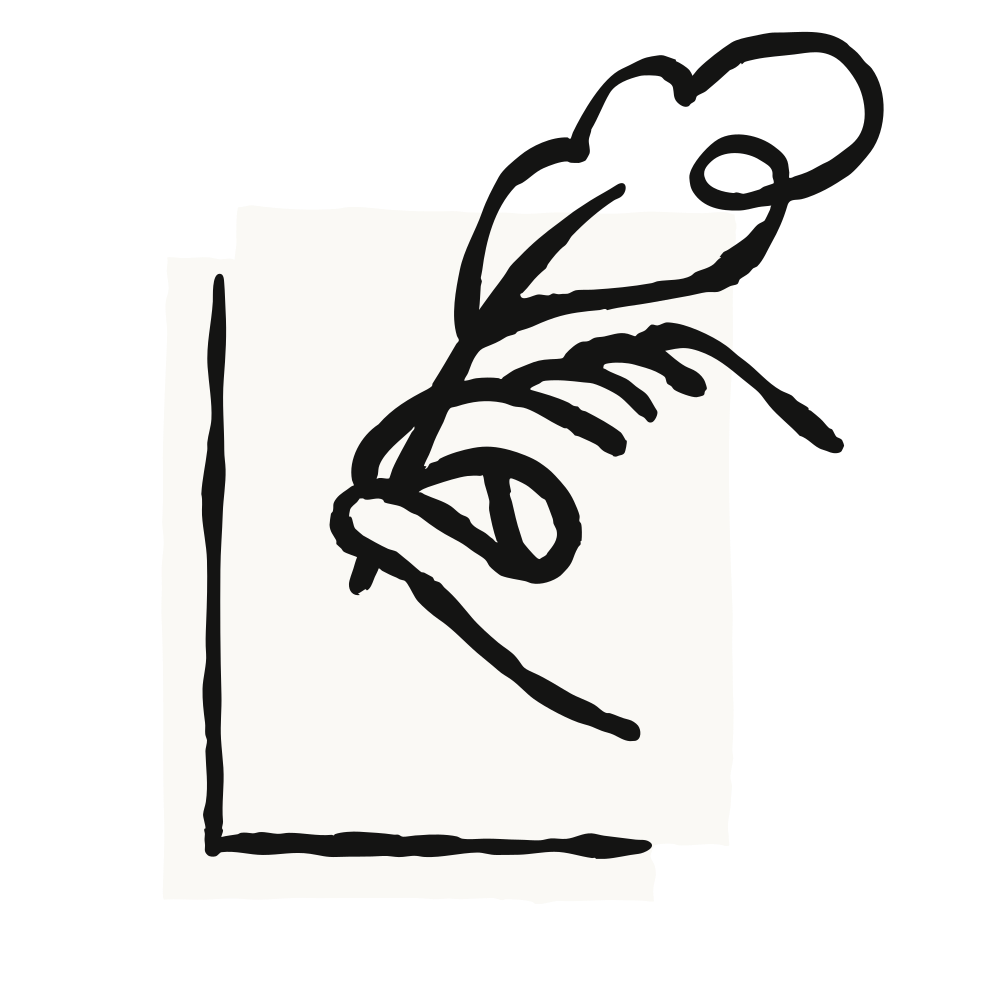

*Estimated Time: 15 minutes*

## What you’ll learn

By the end of this lesson, you'll be able to:

* Understand the Delegation competency and its three components: Problem Awareness, Platform Awareness, and Task Delegation
* Recognize when and how to delegate tasks to AI effectively
* Develop awareness of task, platform, and mode considerations when working with AI

## Video: A Closer Look at Delegation

*(6 minutes)*

This video explores the first core competency of AI Fluency: Delegation. We explain that Delegation focuses on deciding what work to do yourself, what to collaborate on with AI, and how to distribute tasks effectively. We go over the three key components of Delegation:

* Problem Awareness: Understanding your goals and the work involved to achieve it
* Platform Awareness: Knowing what different AI systems can do
* Task Delegation: Strategically dividing work between you and AI

We also emphasize why effective Delegation requires both expertise in your field and understanding of AI capabilities —and why it’s essential for working effectively and efficiently with AI systems.

#### Key takeaways

* Delegation is about making thoughtful decisions about what work to do yourself, what to do together with AI, or what to let AI handle independently, and how to distribute those tasks.
* Problem Awareness means clearly understanding your goals and the nature of the work before involving AI.
* Platform Awareness involves understanding the capabilities and limitations of different AI systems.
* Task Delegation is the process of thoughtfully distributing work between humans and AI to leverage the strengths of each.
* Effective delegation requires both domain expertise and an understanding of AI capabilities.
* The goal isn't to automate everything, but to create the most effective human-AI partnership for any given task or goal.

## Exercises

### Exercise: Analyze Tasks with an AI Assistant (10 minutes)

Instructions:

1. Pick a simple task from your work or personal life (something fairly small like drafting an email, outlining a presentation, or planning a meeting or event).
2. Start a conversation with Claude
3. With Claude, share the task you are thinking about doing.
   * E.g. “Hi Claude, I’m preparing how to [insert task] and want to discuss with you what a delegation plan may look like for figuring out which parts I should delegate to an AI like you vs. not. Can you help me with this?”
4. Together, explore these questions:
   * What is the overall vision for the task? What does a good result look like?
   * What are the different bits of work needed to get there?
   * Which of these bits of work require human expertise, creativity, or judgment?
   * *Note: When discussing these questions, have an actual conversation! Don’t just make statements or list answers. Actually have a chat back and forth—you each may see something the other doesn’t!*
5. Work together to create a simple delegation plan that uses both your strengths and the AI’s strengths.

### Reflection

Before moving on, take a moment to consider:

* Think about a recent project where you worked with AI. How might your approach have been different with this Delegation framework in mind?
* What types of tasks in your work or studies do you think would benefit most from AI collaboration?

## Lesson resources

### Delegation summary slide (8.5x11)

A concise summary of the Delegation competency that you can print as a quick reference.

[Download](phamflets/470922b2df5bc274a529eb542295192488db49d0.pdf)

### Delegation summary slide (16x9)

A concise summary of the Delegation competency that you can use in delivering presentations.

[Download](phamflets/735241c3b91699d1f4aa9422c081ae4eeefc2586.pdf)

#### **What’s next**

In the next lesson, you'll apply what you've learned about Delegation to a multi-step project that you'll work on throughout the rest of this course. You'll select a project that interests you, define your vision for it, break it down into tasks, and create a delegation plan that strategically divides work between you and AI (much like you practiced in this lesson). This project will serve as a practical canvas for applying all the AI Fluency competencies as you progress through the course.

#### Feedback on this course

As you progress through the course, we'd love to hear from you about how you are using concepts from the course in your life, work, or classes and any feedback you may have. [Share your feedback here.](https://forms.gle/zURqLbVgdDqGhHZk9)

#### Acknowledgments and license

*Copyright 2025 Rick Dakan, Joseph Feller, and Anthropic. Released under the CC BY-NC-SA 4.0 license.*

*This course is based on The AI Fluency Framework by Dakan and Feller.*

*Supported in part by the Higher Education Authority, Ireland, through the National Forum for the Enhancement of Teaching and Learning.*